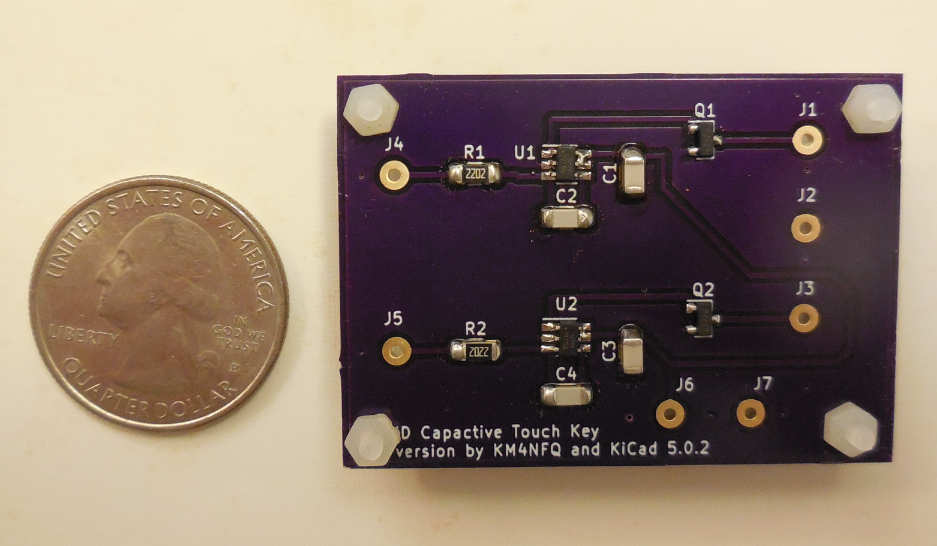
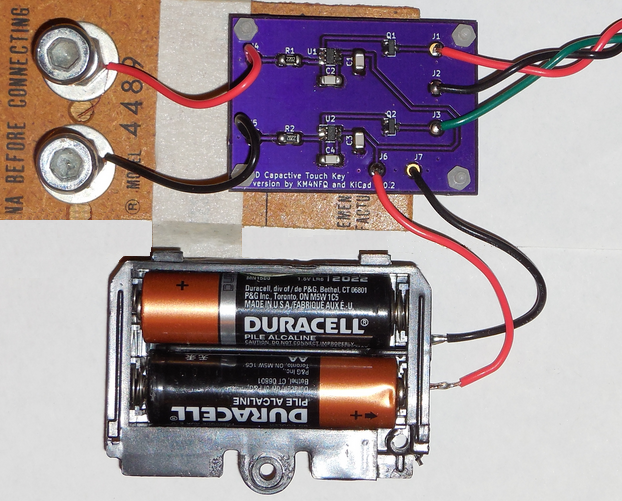

# Capacitive Touch Key

This key is based on the M0UKD Capacitive Touch Key described at:

https://m0ukd.com/homebrew/capacitive-cw-touch-key-circuits/

I modified the PCB to have through hole pads for the wiring.

This PCB can be ordered from OSH Park: 

https://oshpark.com/shared_projects/urEWNyZZ

## Bill Of Materials

2 - 22K Ohm resistors, SMD 1206, Thick Film (R1, R2)

2 - 0.1uF capacitors, SMD 1206 (C1, C3)

2 - 2.2nF capacitors, SMD 1206 (C2, C4)

2 - IRFML8244 MOSFETs, SMD SOT-23 (Q1, Q2)

2 - AT42QT1011 Touch sensors, SMD (U1, U2)

1 - Capacitive Touch Paddle PCB (from your favorite Fab House)

1 - TRS Stereo Plug, 3.5mm, solder type

1 - AA battery holder

2 - AA Cells

2 - Conductive Paddle Material (Acorn Nuts, Angle Brackets, Etc.)

X - 22 AWG Stranded Hook-up Wire

1 - Enclosure

## Assembly

### Power

J6 = +3V Battery (2 AA cells)

J7 = Battery GND

### Keyer

J1 = Tip

J2 = Sleeve

J3 = Ring

### Paddles

J4 = DIT

J5 = DAH

### Components

C1, C3 = 0.1uF Capacitors (1206)

C2, C4 = 2.2nF Capacitors (1206)

Q1, Q2 = IRFML8244 MOSFET (SOT-23)

R1, R2 = 22K Ohm Resistors (1206) Thick Film

U1, U2 = AT42QT1011 Touch Sensor (6-pin, Dot on Pin 1)

